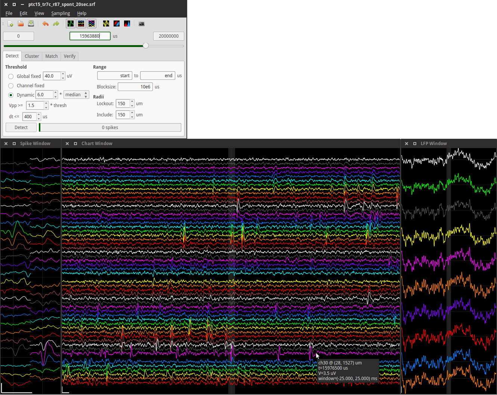
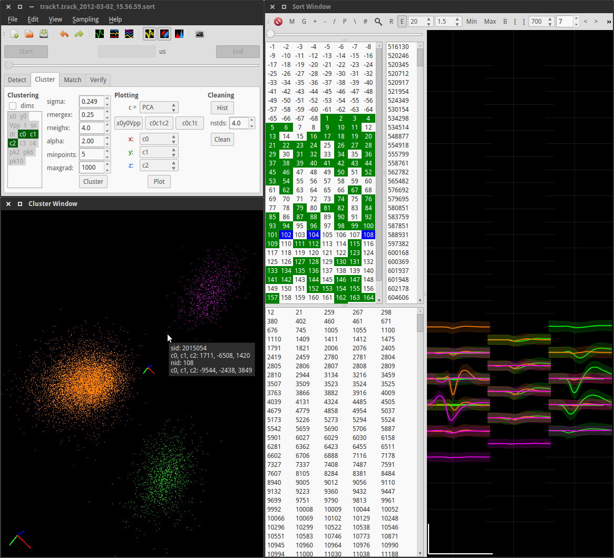

The latest version is available from its [GitHub repository](http://github.com/spyke/spyke).
Documentation is currently very sparse. My [thesis (Chapter 3 and Appendix
C.2)](http://mspacek.github.io/mspacek_thesis.pdf) details the many steps involved. A recent
paper [(Spike sorting for polytrodes: a divide and conquer
approach)](http://www.frontiersin.org/Systems_Neuroscience/10.3389/fnsys.2014.00006/abstract)
describes an alternative implementation of the same general idea. I also plan on recording, at
some point, a short screencast demonstrating typical operation. This flowchart is an overview
of the process:

This screenshot shows how time series voltage waveforms are displayed in spyke:

**Top left**: The main program window, with the spike detection tab selected. Below that are 3
windows displaying voltage waveforms. The first two display high-pass spike data in two
different layouts. The spike window (**left**) displays 1 ms of data in a 2D spatial layout,
and the chart window (**middle**) displays 50 ms in a 1D vertical layout. The third window
(**right**) displays 1 s of low-pass LFP data in a 1D vertical layout. All windows can be
resized. Vertical positions of channels correspond to each other in all 3 windows. The central
highlighted area in the chart window corresponds to the 1 ms time range in the spike window,
and the central highlighted area in the LFP window corresponds to the 50 ms time range in the
chart window. Scrolling through the data in the main window, or clicking a time point on which
to center a waveform window, updates all 3 waveform windows. Channels are enabled or disabled
by right-clicking on them. Pointing at a channel displays information such as the channel
number and its physical position on the polytrode. After spike detection is complete, raster
lines are superimposed on the time series data (not shown). The displayed data is from this 20
s long [sample file](http://swindale.ecc.ubc.ca/spyke). Scale bars: 1 ms, 100 µV.

This second screenshot shows detected spikes being sorted:

**Top left**: The main window, with the clustering tab selected. Dimension reduction and
clustering controls are visible. **Bottom left**: The cluster window showing three clusters
(orange, green, magenta). Each point represents a spike in 3D cluster space.
[PCA](http://en.wikipedia.org/wiki/Principal_component_analysis) cluster space is shown in
this example. Other possibilities include
[ICA](http://en.wikipedia.org/wiki/Independent_component_analysis), time, and/or spatially
localized position. The tooltip shows information about one particular spike and its parent
(magenta) cluster. Using the mouse, the view can be rotated, zoomed, and panned, and spikes
and clusters can be selected and deselected. The value of the clustering parameter
[σ](http://www.frontiersin.org/Systems_Neuroscience/10.3389/fnsys.2014.00006/abstract) can
also be manipulated directly in this window using the mouse, with the central axes scaling
accordingly. **Right**: The sort window is divided into two areas: a set of selection lists on
the left, and a waveform display on the right. Clockwise from top left, the lists represent
clusters, spikes belonging to the selected clusters, and unsorted spikes. Clusters marked as
"good" are highlighted in the cluster list in green, and selected clusters are highlighted in
blue. The 3 selected numbers are the IDs of the 3 clusters displayed in the cluster window,
and their corresponding mean waveforms (± 2 standard deviations) are shown in the waveform
display. Selected channels and spike time ranges are represented by green horizontal lines
underneath the waveforms (partly obscured). If specific spikes are selected, their waveforms
are also plotted. Scale bar: 1 ms, 100 µV.

<!---
Here is a test screencast, just to see how well it works (or doesn't):

<video src="images/test.webm" width="854" height="480" controls preload></video>

-->

For more details, see the current [README.md](https://github.com/spyke/spyke#readme) or the
brief [TUTORIAL.md](https://github.com/spyke/spyke/blob/master/TUTORIAL.md)

[Sample data](http://swindale.ecc.ubc.ca/spyke) is available, as is a [much older
version](http://swindale.ecc.ubc.ca/spyke) of spyke, which was described in the paper [Python
for large-scale
electrophysiology](http://www.frontiersin.org/Neuroinformatics/10.3389/neuro.11.009.2008/abstract).
